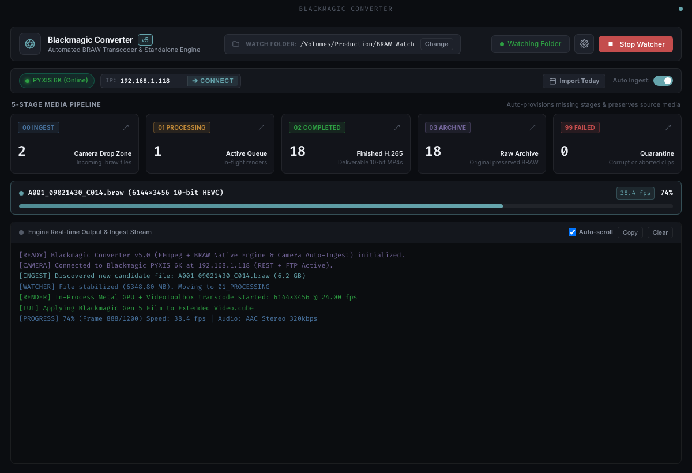
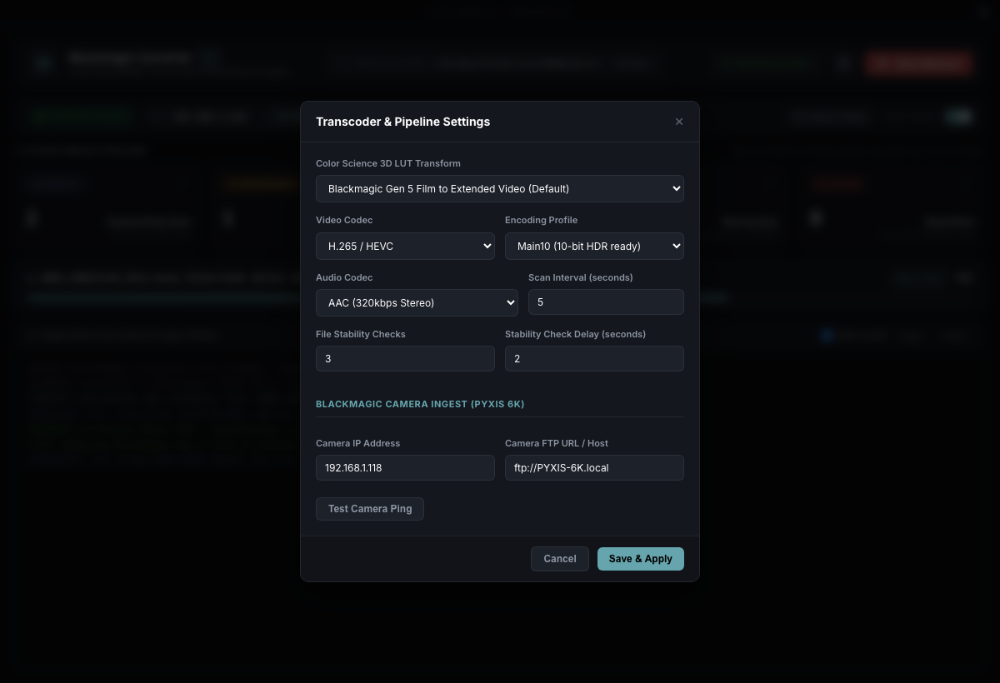

# Blackmagic BRAW Converter

Automated hot-folder monitoring and standalone video transcoding workstation for Blackmagic RAW (`.braw`) media.

The application combines an Electron desktop interface with an in-process native Metal compute engine, Apple VideoToolbox hardware encoder, and background camera synchronization. It operates independently without requiring DaVinci Resolve or external dongles.



---

## Core Capabilities

- **Metal GPU Color Science**: In-process Metal 3D LUT compute pipeline reading RAW pixel buffers and encoding directly to 10-bit H.265 (HEVC Main10), H.264, or ProRes deliverables via VideoToolbox.
- **Automated Hot-Folder Staging**: 5-stage hot-folder watcher with POSIX file-locking and size-stability verification to prevent premature transcoding of in-flight transfers.
- **Blackmagic Camera Network Ingest**: Background service connecting to Blackmagic cameras (PYXIS 6K, Cinema Camera 6K, Pocket series) via REST and FTP. Automatically detects record stop transitions, extracts takes, and transfers media into the ingest queue.
- **Bundled 3D LUT Profiles**: Includes 23 Blackmagic Generation 4 and Generation 5 color science conversion LUTs in `assets/luts/`.
- **Standalone Architecture**: Zero dependencies on DaVinci Resolve or Resolve Studio licenses.

---

## Installation & Quick Start

### Prerequisites

- macOS 14 (Sonoma) or macOS 15 (Sequoia) on Apple Silicon (M1/M2/M3/M4)
- Node.js 20 or later
- Python 3.10 or later
- FFmpeg (accessible in system PATH or installed via Homebrew)

### Running from Source

```bash
# Clone the repository
git clone https://github.com/aw3ksam/Blackmagic-BRAW-Converter.git
cd Blackmagic-BRAW-Converter

# Install dependencies
npm install
pip3 install -r requirements.txt

# Launch the application
npm start
```

### Building Distributables

```bash
# Package application bundle into out/
npm run package

# Build macOS installer packages (.dmg and .zip) in out/make/
npm run make
```

A pre-compiled native decoder binary for Apple Silicon is located at `bin/braw_decode`. If modifying native source files in `src/native/`, recompile with:

```bash
npm run build:decoder
```

---

## Media Pipeline Workflow

The watcher monitors an ingest directory structured into five lifecycle folders:

```text
watch_folders/
├── 00_IN_INGEST/          # Entry directory for incoming .braw clips
├── 01_PROCESSING/         # Active transcoding queue
├── 02_COMPLETED_MP4/      # Output directory for rendered deliverables
├── 03_ARCHIVE_BRAW/       # Storage for completed source .braw files
└── 99_FAILED/             # Quarantine for corrupted or unreadable clips
```

### Staging Lifecycle

1. A `.braw` clip is placed into `00_IN_INGEST/` manually or downloaded by the camera auto-ingest service.
2. The stability guard samples file size and POSIX locks across consecutive intervals (`stability_checks` at `stability_delay` intervals).
3. Upon stabilization, the clip and any companion `.sidecar` files are moved atomically to `01_PROCESSING/`.
4. The transcode engine decodes the RAW stream, applies the configured 3D LUT, and writes hardware-encoded video with preserved source timecode and audio tracks.
5. Deliverables are saved to `02_COMPLETED_MP4/`.
6. Source `.braw` files are moved to `03_ARCHIVE_BRAW/` to preserve camera originals.

---

## Settings & Configuration

Application parameters can be configured through the desktop user interface or edited directly in `config/config.yaml`:



```yaml
# Storage and Folder Paths
storage:
  ingest_dir: "./watch_folders/00_IN_INGEST"
  processing_dir: "./watch_folders/01_PROCESSING"
  completed_dir: "./watch_folders/02_COMPLETED_MP4"
  archive_dir: "./watch_folders/03_ARCHIVE_BRAW"
  failed_dir: "./watch_folders/99_FAILED"

# Watcher Stability Parameters
watcher:
  poll_interval: 2.0
  stability_checks: 3
  stability_delay: 2.0
  extensions:
    - ".braw"
  include_sidecars: true

# Transcoding Parameters
transcode:
  container: "mp4"
  codec: "H265"
  encoding_profile: "Main10"
  resolution: "source"
  frame_rate: "source"
  bitrate_mbps: 0          # 0 = automated rate control
  audio:
    codec: "aac"
    sample_rate: 48000
    bitrate_kbps: 320
  color:
    mode: "lut"
    lut_path: "Blackmagic Gen 5 Film to Extended Video.cube"
```

---

## Headless CLI Operation

The underlying Python transcoding and monitoring engine can be executed headlessly for server environments and automated pipelines:

```bash
# Run the hot-folder watcher service
python3 -m src.cli watch --config config/config.yaml

# Transcode an individual file
python3 -m src.cli transcode /path/to/clip.braw -o /path/to/output.mp4

# Run manual batch conversion on a directory
python3 -m src.cli transcode /path/to/folder/ -o /path/to/output/

# List all bundled and system 3D LUT profiles
python3 -m src.cli list-luts

# Execute environment and dependency diagnostics
python3 -m src.cli test-env

# Run headless camera auto-ingest service
python3 -m src.cli camera-service --camera-ip 192.168.1.118 --camera-ftp ftp://PYXIS-6K.local
```

---

## Project Structure

```text
├── assets/
│   ├── icons/                  # Application icon sets (.icns, .ico, .png)
│   ├── luts/                   # 23 bundled Blackmagic Gen 4 and Gen 5 3D LUTs
│   └── screenshots/            # Interface reference images
├── bin/
│   └── braw_decode             # Compiled native Metal / VideoToolbox executable
├── config/
│   ├── config.default.yaml     # Baseline configuration template
│   └── config.yaml             # Active runtime configuration
├── entitlements/               # macOS hardened runtime entitlement definitions
├── forge.config.js             # Electron Forge packaging configuration
├── package.json                # Project dependencies and lifecycle scripts
├── requirements.txt            # Python dependencies (pyyaml, watchdog)
├── scripts/
│   ├── build_decoder.sh        # Native Metal decoder compilation script
│   ├── start_electron.sh       # Development launcher
│   └── start_watcher.sh        # Standalone watcher launcher
├── src/
│   ├── camera/                 # Blackmagic REST client, FTP engine, and auto-ingest
│   ├── common/                 # Configuration loader, file watcher, stability guard
│   ├── electron/               # Electron main process, preload bridge, and renderer UI
│   ├── ffmpeg_engine/          # Transcoding pipeline, LUT manager, and decoder bridge
│   └── native/                 # Objective-C++ Metal compute and VideoToolbox source
└── tests/                      # Automated unit and integration test suite
```

---

## Testing

Execute the test suite covering the camera REST client, stability guard, watcher state transitions, LUT resolution, and decoder bridge:

```bash
npm test
```

---

## License

Apache-2.0
